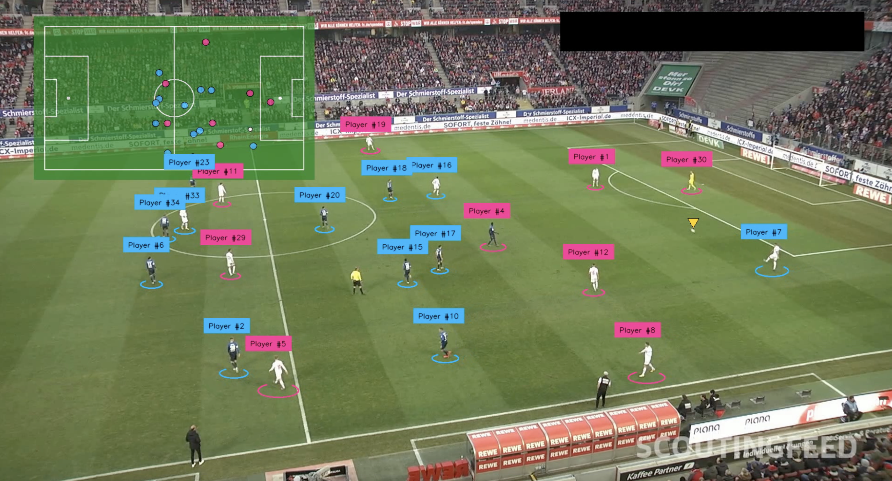
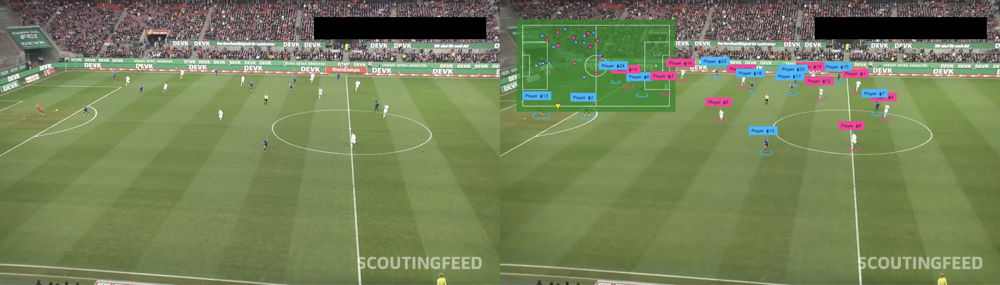

# FootballVision

FootballVision turns raw football (soccer) match footage into structured player and ball tracking data. It uses computer vision — object detection with YOLO models trained via Roboflow — to detect players, referees, and the ball on the pitch, track them across frames, clean up the resulting data, and export the result as annotated video clips or tracking-data CSVs.

The goal is to give clubs and analysts at any level a way to convert match video into usable tracking and event data without needing a professional tracking system.



## What It Does

The project covers the full pipeline from footage to usable data:

1. **Train a detection model** — build a YOLO-based model that recognizes players, referees, and the ball.
2. **Track match footage** — run the trained model over a match clip to generate frame-by-frame tracking data.
3. **Clean the tracking data** — smooth out missed detections, fix mislabeled players, merge broken tracks, and correct the ball's path.
4. **Generate output clips** — turn the cleaned tracking data into annotated video and a 2D mini-map view of the match.



## Project Structure

| Folder / File | Purpose |
|---|---|
| `train/` | Notebook for training the player/ball/referee detection model |
| `track/` | Notebook for running detection + tracking on match footage |
| `data_cleanup/` | Notebook and tools for cleaning and inspecting tracking output |
| `examples/` | Sample images used in this README |
| `env/` | Holds API keys / environment config |
| `csv_to_video.py` | Converts a cleaned tracking CSV back into a video clip |
| `requirements.txt` | Python dependencies |

## Getting Started

**Requirements:** Python 3.11, a [Roboflow](https://roboflow.com/) account and API key.

1. Clone the repository:
   ```bash
   git clone https://github.com/Bilal4717/FootballVision.git
   cd FootballVision
   ```

2. Create and activate a virtual environment:
   ```bash
   python3 -m venv .venv
   . .venv/bin/activate
   ```

3. Install dependencies:
   ```bash
   pip install -r requirements.txt
   ```
   > `requirements.txt` includes commented-out GPU packages — uncomment them if your machine has a GPU.

4. Create `env/keys.env` and add your Roboflow API key:
   ```bash
   touch env/keys.env
   ```
   ```
   ROBOFLOW_API=XXXXXXXXXXXXXXX
   ```

## Pipeline Walkthrough

### 1. Train a Detection Model
Run `train/train.ipynb` to train a model that detects players, the ball, and referees. The resulting `.pt` model file is what you'll use in the tracking step.

- Training is resource-intensive — if you don't have a local GPU, Google Colab is a solid, low-cost option.

### 2. Track Match Footage
Run `track/track.ipynb`:
1. Drop your match clip (MP4) into `track/footage/`.
2. Point the notebook at your trained model (or a Roboflow-hosted one).
3. Set `SOURCE_VIDEO_PATH` / `VIDEO_FILE` to your clip.
4. Optionally enable `GENERATE_VIDEO` or `TRACK_TEAMS` in the config section.
5. Run the notebook — output lands in `track/output/` as a CSV.

> Early-stage video output tends to be rough (missed detections, jitter). It's useful as a sanity check, but the real output comes after cleanup.

### 3. Clean the Tracking Data
Run `data_cleanup/cleanup.ipynb`, which loads your tracking CSV into a `Match` object with tools for fixing common tracking issues:

- **Clean the ball's path** — remove outliers, fill gaps, smooth arcs:
  ```python
  match.ball.clean_path()
  ```
- **Visualize a path** — for the ball or any player:
  ```python
  match.ball.plot()
  ```
- **Fix a mislabeled player**, remove a false detection, merge a track that got split, reassign a team, or rename a player using `match.player()`, `match.remove_player()`, `match.merge_players()`, and the `Player` object's `change_team()` / `change_name()` methods.

Cleaned results are exported to `data_cleanup/output/`.

### 4. Generate a Tracking Clip
Run `csv_to_video.py` (after setting `FILE_NAME`, `CSV_PATH`, and `SOURCE_VIDEO_PATH` at the top of the script) to render your tracking data back onto the footage, alongside a 2D pitch mini-map.

## Resources

This project builds on techniques and tutorials from:

- Skalskip92's Football AI tutorial series (Roboflow)
- Roboflow's pitch and player keypoint-detection notebooks
- Eric Fenaux's work on smoothing ball-path tracking
- ML with Hamza's YOLOv8 + OpenCV football analysis approach
- Mihailo Radović's tracking improvements (possession detection, speed estimation, performance)

## License

MIT License. 
